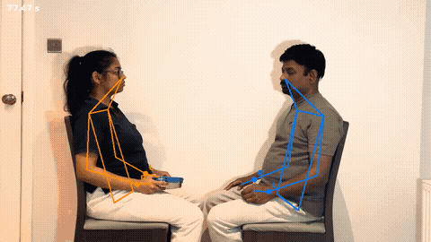
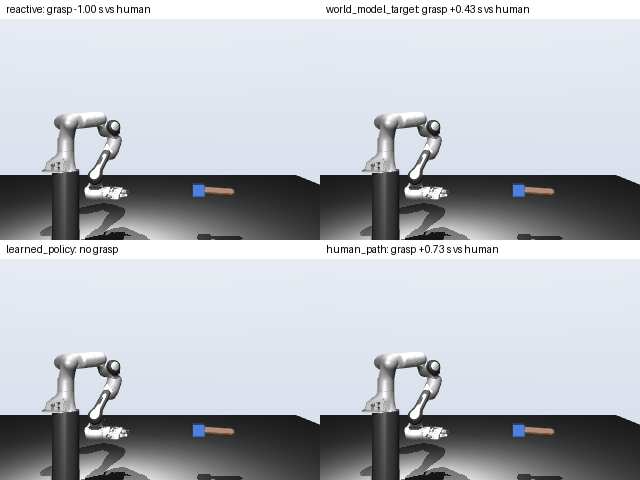
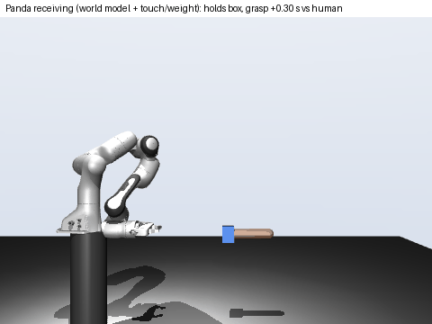
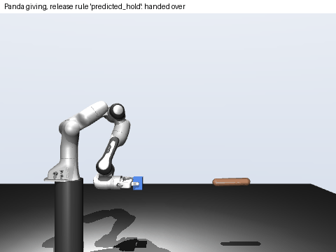
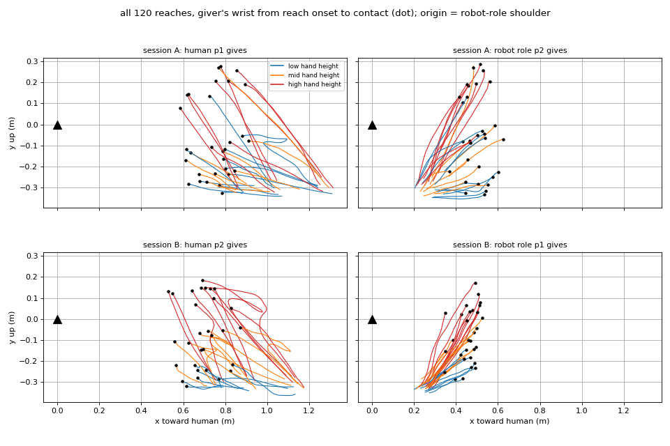
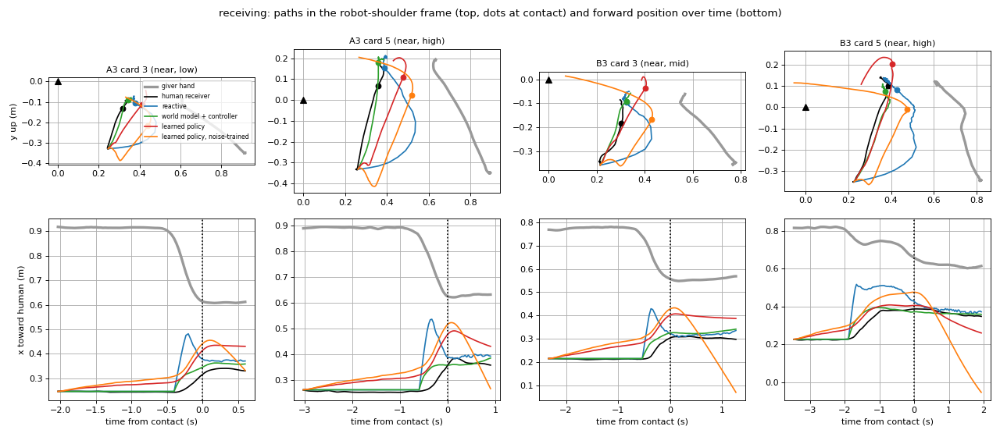
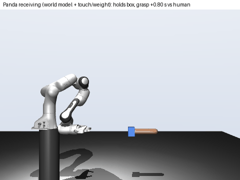
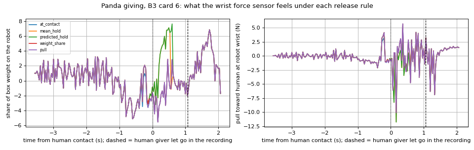

# Learning to receive objects from human handover video

Two people sit facing each other and pass an object back and forth, filmed side-on with one phone.
The person in the right chair plays the robot: back on the backrest, only the arm moves, like an arm
bolted to a table. From 120 recorded handovers I learn a **world model** that predicts where the
human's hand will meet the robot's, and use it, together with touch and wrist-force sensing, to make a
Franka Panda in MuJoCo **receive** objects from replayed human hands and **give** them back.

| Recorded handover (tracked) | Same handover, Panda receiving (kinematic simulation) |
|---|---|
|  |  |

| Panda receiving (physical simulation) | Panda giving (physical simulation) |
|---|---|
|  |  |

Examples of successful handovers on the test takes; success rates over all test handovers are below.

## The data

- **Set-up.** iPhone on a tripod 1.77 m from the handover line, 1080p 30 fps. Human in the left chair
  (right hand), robot role in the right chair (left hand), both hands on the camera side. Human chair
  at three gaps (0.33 / 0.50 / 0.75 m); hand height low / mid / high; speed slow / normal / quick;
  a few deliberate hesitations (stop halfway, then continue).
- **Handovers alternate**: odd card = human gives to the robot role, even card = robot role gives back,
  same conditions. A third person holds a numbered card in front of the lens between handovers.
- **Scale.** At the start of every take a red stick with two white bands 1.00 m apart is held level
  (pixels per metre) and then hanging (direction of gravity).
- **Amount.** 6 takes x 20 = 120 handovers (60 per direction), two people (p1, p2) who swap roles
  between sessions A and B, three objects (mug, bottle, box of about 100 g), plus a set-up check.
- **Split, fixed before training.** Train A1, A2, B1, B2 (mug, bottle); test A3, B3 (box, never seen).
  Second split: train on session A, test on session B (each person in a role they never had in training).

`data/` holds everything needed to rerun from stage 2: the videos (540p, no audio, metadata removed),
tracked keypoints, calibration, handover events and the take sheet (`data/take_sheet.csv`, with notes
on what actually happened, e.g. which hesitations were performed).



## Pipeline

| Stage | Module | What it does |
|---|---|---|
| 1 Tracking | `handover/track.py` | MediaPipe PoseLandmarker (2 people) on every frame; left person = human, right = robot role |
| 2 Segmentation | `handover/segment.py` | Handovers = stretches where both people and both handover wrists are visible (cards hide them); events from wrist distance and displacement: giver onset, receiver onset, contact, release |
| 3 Calibration | `handover/calibrate.py` | Stick bands -> px per metre per take; hanging stick -> gravity; origin = robot-role shoulder just before the giver moves; x toward the human, y up |
| 4 World model | `models.py`, `train.py`, `evaluate.py` | GRU on the giver's wrist history predicts the next 0.5 s, the handover point and time to contact; baselines: stay, mean, constant velocity, Kalman, minimum-jerk |
| 5 Receiving | `handover/policy.py` | Reactive chase vs world model + controller vs behaviour cloning (with and without the world model as input), closed loop |
| 6 Release timing | `handover/release.py` | From the robot-role giver's handovers: predict at contact how long the giver keeps holding |
| 7 Kinematic sim | `handover/sim.py` | Menagerie Panda, damped least-squares IK, replayed human hand holding the object |
| 8 Physical sim | `handover/force.py` | Box with mass, human grip as a compliant spring, wrist force sensor and finger touch; receiving and giving |
| 9 RL | `handover/rl.py` | Tracking receiver (follow the box one object length back, slide in when the hand stops moving forward) with a learned residual policy on top (cross-entropy method) |

## How to run

```bash
python3 -m venv venv && source venv/bin/activate
pip install -r requirements.txt          # torch with CUDA if available; everything also runs on CPU
git clone --depth 1 https://github.com/google-deepmind/mujoco_menagerie.git

python -m handover.dataset                                   # results/reaches.png
python -m handover.evaluate      > results/baselines.txt
python -m handover.train         > results/world_model.txt   # GPU: ~1 s per model
python -m handover.policy --plot results/policy_examples.png > results/policy.txt
python -m handover.release       > results/release.txt
python -m handover.sim --gap mean > results/sim_mean_gap.txt
python -m handover.sim --gap other_take > results/sim_other_take_gap.txt
python -m handover.force         > results/force.txt         # physical receiving + giving, force_giving_example.png
python -m handover.rl            > results/rl.txt            # tracking receiver + RL, ~1.5 h on 16 CPU cores
python -m handover.rl --summary results/rl_receiving.csv    # success per seed
# GIFs (one per call):
python -m handover.sim --gap other_take --render-only --gif B3:5
python -m handover.force --render-receive A3:3
python -m handover.force --render-receive B3:11
python -m handover.force --render-give B3:18 --rule predicted_hold
```

All learned results use seeds 0-4; neural networks train on the GPU when available and the runs are
reproducible. Rendering needs an OpenGL context (`MUJOCO_GL=egl` on a Linux GPU machine; under WSL2 I
used `MUJOCO_GL=glfw MESA_D3D12_DEFAULT_ADAPTER_NAME=NVIDIA`). Stages 1-3 need the original 1080p
recordings, which are not in the repo:

```bash
python -m handover.track VIDEO data/TAKE_pose.npz --model pose_landmarker_heavy.task
python -m handover.overlay VIDEO data/TAKE_pose.npz overlay.mp4
python -m handover.segment data/TAKE_pose.npz data/segments/TAKE.csv --sheet data/take_sheet.csv --plot events.png
python -m handover.calibrate VIDEO data/TAKE_pose.npz data/calib/TAKE.json
```

## Results

All numbers are printed by the commands above (`results/*.txt`; per-handover rows in `results/*.csv`).

### World model: where will the hand meet the robot's?

Test takes A3, B3 (20 human-to-robot reaches, unseen object). Error of the predicted handover point
after seeing 25 / 50 / 75 % of the reach; GRU averaged over 5 seeds.

| Method | 25 % | 50 % | 75 % |
|---|---|---|---|
| stay (hand stops now) | 26.5 cm | 16.1 cm | 6.9 cm |
| mean training handover point | 16.2 | 16.2 | 16.2 |
| constant velocity | 16.3 | 18.8 | 6.5 |
| Kalman filter (constant velocity) | 14.6 | 18.3 | 7.3 |
| minimum-jerk fit | 122.6 | 18.1 | 6.6 |
| **GRU world model** | **8.2** | **7.2** | **6.3** |

Next 0.5 s of the giver's hand, mean error during the reach: GRU **3.3 cm**, constant velocity 5.9,
Kalman 6.3, minimum-jerk 7.6, stay 9.4. GRU error at 50 % per seed: 6.4-9.0 cm.
Unseen person (train session A, test session B): GRU 7.0 / 6.7 / 5.0 cm vs best baseline
13.4 / 13.1 / 4.9 cm; next 0.5 s 3.0 cm vs 5.1 cm.

### Receiving, closed loop on the recorded test reaches

Each controller moves a hand from the receiver's rest pose while the real giver is replayed; its own
errors carry forward. Contact error = distance from where the human receiver was at contact.

| Controller | Contact error | Path error | Arrival vs contact | Arrived within 5 cm | Grasp timing error |
|---|---|---|---|---|---|
| human receiver (reference) | 0 | 0 | -0.28 s | 100 % | 0 |
| reactive chase | 9.4 cm | 20.5 cm | +0.20 s | 35 % | 0.77 s |
| **world model + controller** | **6.6 cm** | 13.5 cm | -0.69 s | **89 %** | **0.15 s** |
| behaviour cloning | 10.9 cm | 9.4 cm | -0.29 s | 57 % | 0.24 s |
| behaviour cloning + world model input | 10.4 cm | **9.3 cm** | -0.36 s | 75 % | 0.20 s |
| behaviour cloning, noise-trained | 11.8 cm | 12.0 cm | -0.28 s | 54 % | 0.20 s |

Unseen person: world model + controller 4.9 cm contact error (89 % arrived) vs reactive 6.0 cm and
behaviour cloning 10.9 cm.



### Kinematic simulation: Panda receiving

The human hand is replayed at its real position and speed relative to the robot-role shoulder, which
sits at the Panda's shoulder. The controllers drive the Panda through IK and its joint servos; the box
counts as grasped when the gripper is within 5 cm and the controller says grasp. 20 test handovers x
5 seeds. "Object known" uses the hand-to-hand gap measured on the *other* box take (A3 from B3 and vice
versa); "average" uses the mug/bottle training gap.

| Controller | Success (average gap) | Success (object known) | Grasp vs human contact | Gripper path |
|---|---|---|---|---|
| reactive chase | **100 %** | **95 %** | -0.39 s | 0.57 m |
| world model + controller | 93 % (seeds 90-100) | 89 % (85-95) | +0.13 s | 0.56 m |
| human receiver's path (reference) | 85 % | 90 % | +0.06 s | 0.40 m |
| behaviour cloning + world model input | 52 % | 19 % | +0.35 s | 0.69 m |
| behaviour cloning | 49 % | 28 % | +0.54 s | 0.62 m |
| behaviour cloning, noise-trained | 38 % | 26 % | +0.54 s | 0.67 m |

(Timing and path: object-known run.) At real human speed the Panda can keep up, so simply chasing the
hand works in this simplified grasp. An earlier version that scaled human motion up 1.4x to the Panda's
reach asked the arm to move faster than it can; there the world model clearly beat chasing (88 % vs
65 %; commit `0c30550`, `results/sim.txt`). Prediction matters when the robot is slower than the human. The cloned policies learned hand
positions from the mug and bottle and do not transfer to the box.

### Physical simulation: receiving with touch and weight

The box (100 g, weighed) has mass and friction; the Panda squeezes it (30 N); the human's grip is a
compliant spring that carries the box's weight until the recorded moment they let go; the Panda has a
wrist force sensor and finger contact. A grasp counts only when the fingers stop on the box. The
controller approaches, lines up in front of the box and slides in along the gripper axis, closes, and
then pulls back.

| Physical receiving (20 test handovers x 5 seeds) | Success | Grasp vs human contact | Weight felt after the human let go | Tug while the human still holds |
|---|---|---|---|---|
| world model + controller, pull back right after the grasp | 83 % | +0.45 s | - | 7.8 N |
| **world model + controller, wait until the weight is felt** | **84 %** | +0.45 s | **0.14 s** | **3.2 N** |
| reactive chase, wait until the weight is felt | 90 % | -0.25 s | 0.13 s | 6.8 N |

Waiting until the weight arrives halves the tug, and the robot notices the human letting go within
0.14 s. Chasing grabs the box earlier, often mid-reach, and pulls twice as hard; heading for the
predicted handover point takes it more gently.



### Physical simulation: tracking receiver and RL

A second receiver follows the idea of watching the hand rather than predicting it: it tracks the box
one object length back, slides in when the hand stops moving forward, holds once the fingers have the
box, and pulls back once the weight is felt. Here the replayed human waits for the robot's grip
before letting go (as the givers in the recordings were told to), for up to 3 s. A linear residual
policy on top (motion correction, when to close, when to pull back; 20 sensor inputs including touch,
wrist force and how long the hand has been held still) was trained with the cross-entropy method on
the 40 training handovers, with small random shifts of the hand, grip and timing.

| Tracking receiver (5 seeds) | Test success | Train success | Dropped (test) | Box pushed before grasp | Grasp vs contact |
|---|---|---|---|---|---|
| **without RL** | **64 %** (seeds 60-65) | 52 % | 1 % | 9.3 cm | +1.05 s |
| with RL | 36 % (25-50) | 48 % | 11 % | 18.1 cm | +2.06 s |

RL raised its reward but lowered success: because the human waits, grasping late and pushing the box
cost little, and the policy learned exactly that.

### When does a giver let go?

From the 60 robot-role-to-human handovers: at the moment of contact, predict how long the giver keeps
holding.

| Method | Main split: mean error | released early | Unseen person: mean error | released early |
|---|---|---|---|---|
| release at contact | 0.87 s | 100 % | 0.95 s | 100 % |
| mean training hold | 0.16 s | 20 % | **0.15 s** | 47 % |
| **GRU on the approach** | **0.10 s** | 16 % | 0.18 s | 43 % |

### Physical simulation: Panda giving

The Panda follows the robot-role giver's recorded path (starting from a ready pose 35 cm in front of
its shoulder, since the person's resting hand was inside the Panda's footprint); the recorded human
receiver reaches, grips (from the recorded contact, over 0.2 s) and takes the box away. Five ways to
decide when to open the gripper:

| Release rule (20 test handovers) | Handed over | Dropped | Let go before the human gripped | Release vs the human giver | Tug |
|---|---|---|---|---|---|
| at contact (vision) | 95 % | 5 % | **90 %** | -0.92 s | 0.8 N |
| after the mean training hold | 100 % | 0 % | 0 % | +0.01 s | 6.8 N |
| **after the predicted hold (GRU, 5 seeds)** | **100 %** | 0 % | 0 % | **-0.01 s** | 6.6 N |
| weight share below half | 80 % | 0 % | 30 % | -0.49 s | 4.6 N |
| pull above 3 N | 100 % | 0 % | 10 % | +0.25 s | 7.6 N |

Releasing at first contact lets go before the human has gripped in 9 of 10 handovers (a drop on a real
person; the replayed hand catches it here). The learned hold time releases within 0.01 s of when the
human giver did. Weight alone is a poor cue with a 100 g object: the 1 N weight change is small next to
the forces from the arm's own motion (B3 card 6):



## Design choices

- **Why receiving, and why a world model.** A robot that only reacts to where the hand *is* arrives late
  when it is slower than the human. Predicting where the hand is *going* lets it move in parallel, as
  the human receiver does. The task has no language and the data is small, so a VLA would add size, not
  ability.
- **A person playing the robot.** The robot-role person's shoulder stays fixed like a robot base, so
  their receiving motion is a demonstration in a robot-like frame.
- **Segmentation from tracking, not from the cards.** While a card is up, one person or both handover
  wrists are hidden, so "both visible" stretches are the handovers; all six takes give exactly 20.
- **Events from simple rules.** Contact and release = entering and leaving the flat minimum of the
  wrist-distance curve; onset = the hand has covered 10 % of its way to contact (robust to
  hesitations). Checked visually against per-handover plots.
- **Calibration per take.** The camera moved slightly between takes (6-8 % change in scale), which the
  stick at the start of every take corrects.
- **Causal inputs, smoothed targets.** Models see only past, unsmoothed positions; scores use smoothed
  tracks. The world model sees only the giver, not the human receiver, whose motion already contains a
  prediction.
- **Small models, fixed settings, 5 seeds.** 40 training reaches; a 64-unit GRU (14k parameters);
  hyperparameters fixed in advance, not tuned on the test takes.
- **Simulation mapping.** The robot-role shoulder sits at the Panda's shoulder and the human hand is
  replayed at its real position and speed (the Panda's arm is longer than a human arm, so every recorded
  handover point is reachable). The Panda's wrist plays the receiver's wrist. Arm control: damped
  least-squares IK holding the gripper level and pointing at the human, clamped to the joint limits and
  to 2.1 rad/s (Panda limit 2.175), with gravity compensation and velocity feed-forward to the servos.
- **Human-like sensing.** People hand over by sight, touch and the feeling of weight shifting. The
  physical simulation gives the Panda the same: vision of the hand and the object, finger contact, and a
  wrist force sensor. A grasp only counts when the fingers stopped on something.
- **Unknowns kept fixed, not tuned.** The human's grip in simulation (spring 80 N/m, at most 8 N,
  ramping over 0.2 s) and the box mass (100 g, weighed) are assumptions; I did not change them to
  improve results.

## What worked and what didn't

- **Worked:** the GRU world model roughly halves the handover-point error of every baseline early in the
  reach and transfers to the other person. With touch and weight sensing the Panda receives the unseen
  box in 84 % of test handovers, notices the human letting go within 0.14 s, and gives the box back in
  100 % with a learned release time within 0.01 s of the human giver's.
- **Prediction vs chasing:** once the simulated human moves at real speed, a fast reactive chase also
  succeeds (and slightly more often); the world-model controller takes the box more gently. With the
  human motion scaled up (a robot slower than the human) the world model clearly won.
- **Behaviour cloning** gives the most human-like path but drifts during the wait, overshoots, does not
  transfer to a new object, and is fragile: with 40 reaches its result changes noticeably between CPU
  and GPU training. Adding the world model as an input helps on arrival; noise injection did not help.
- **RL did not help in the end.** On the earlier, scaled simulation, RL and continued training raised
  physical grasp success from 33 % to 67 % (commit `0c30550`). After fixing the simulated robot (below),
  the hand-designed controllers were better than any RL policy: RL on the tracking receiver learned to
  grasp late and push the box (64 % -> 36 %); a GPU (MuJoCo MJX) network policy and training on failed
  handovers also lowered success. Each time the reward rose while success fell.
- **Simulation problems on the way, all on the robot side:** arm sag (gravity compensation); IK
  instability (joint-speed limit); the replayed hand moving faster than a Panda can (no scaling); the IK
  asking for angles past a joint limit, which twisted the gripper 4-6 cm off the box (joint-limit clamp);
  servo lag (velocity feed-forward); the target drifting out of the handover plane; the gripper closing
  on air (grasp confirmed only when the fingers stop on the box); a giving start pose inside the
  robot's own body (ready pose).
- **Time to contact:** the GRU is no better than the training average.
- **Minimum-jerk fit** is unusable before peak hand speed (the end point is not observable yet).
- **Release timing** predicted from the approach works for the same people, not across people.
- **Weight-based release when giving** fails with a 100 g object; humans also use slip and grip
  pressure, which a wrist sensor does not measure.
- **Speed labels** were followed loosely: "quick" reaches were not faster than "normal".

## Limits

- One camera: 2D (forward and up) only; scale is exact in the plane of the stick, a few cm elsewhere.
- Two people, 120 handovers; results are indicative, especially per condition (7 hesitations in total).
- "Release" in the video is when the hands separate, slightly after the true moment of letting go.
- The robot role is a person keeping still; a human arm is not a Panda.
- The simulated human is a replay with an assumed grip model: in the main physical results it lets go
  at the recorded time; in the tracking-receiver results it waits up to 3 s for the robot's grip. How
  strong and compliant a real grip is cannot be measured from video.
- The kinematic simulation attaches the box once the gripper is within 5 cm; only the physical
  simulation models the grasp. Rare numerical instabilities of the free box occur in long episodes.
- Physics runs on the CPU; MuJoCo MJX can run it on a GPU, but for this small scene on a laptop GPU it
  was only modestly faster than 16-20 CPU cores.

## Credits

MediaPipe (Google, Apache-2.0), MuJoCo (DeepMind, Apache-2.0), Franka Emika Panda model from MuJoCo
Menagerie (Apache-2.0), PyTorch. Minimum-jerk model: Flash & Hogan (1985). Noise injection: Laskey et al.,
DART (2017). Residual RL: Johannink et al. (2019). Human handover grip forces: Chan et al. (2012).
