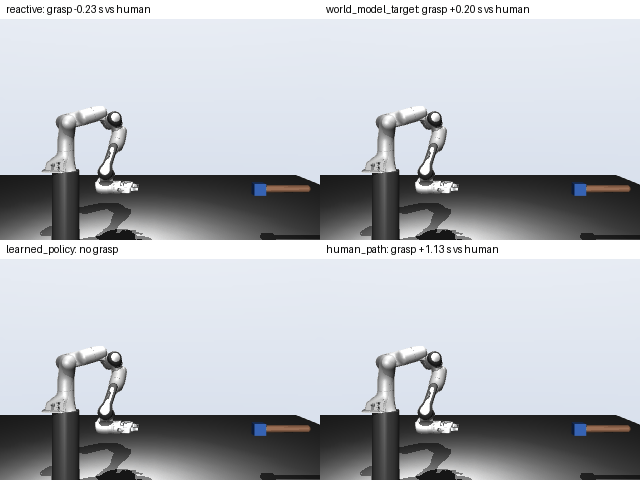
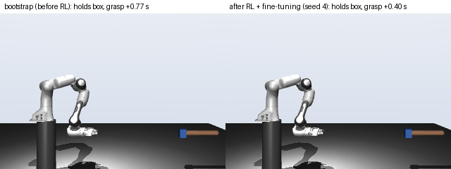
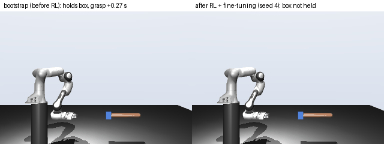

# Learning to receive objects from human handover video

Two people sit facing each other and pass an object back and forth, filmed side-on with one phone.
The person in the right chair plays the robot: back on the backrest, only the arm moves, like an arm
bolted to a table. From 120 recorded handovers I learn a **world model** that predicts where the
human's hand will meet the robot's, use it to drive a Franka Panda in MuJoCo, and then improve the
Panda's physical grasp with **reinforcement learning** on the replayed human hands, using touch and
wrist-force sensing.

| Recorded handover (tracked) | Same handover, Panda receiving (kinematic simulation) |
|---|---|
|  |  |


## The data

- **Set-up.** iPhone on a tripod 1.77 m from the handover line, 1080p 30 fps. Human in the left chair
  (right hand), robot role in the right chair (left hand), both hands on the camera side. Human chair
  at three gaps (0.33 / 0.50 / 0.75 m); hand height low / mid / high; speed slow / normal / quick;
  a few deliberate hesitations (stop halfway, then continue).
- **Handovers alternate**: odd card = human gives to the robot role, even card = robot role gives back,
  same conditions. A third person holds a numbered card in front of the lens between handovers.
- **Scale.** At the start of every take a red stick with two white bands 1.00 m apart is held level
  (pixels per metre) and then hanging (direction of gravity).
- **Amount.** 6 takes x 20 = 120 handovers (60 per direction), two people (p1, p2) who swap roles
  between sessions A and B, three objects (mug, bottle, box of about 100 g), plus a set-up check.
- **Split, fixed before training.** Train A1, A2, B1, B2 (mug, bottle); test A3, B3 (box, never seen).
  Second split: train on session A, test on session B (each person in a role they never had in training).

`data/` holds everything needed to rerun from stage 2: the videos (540p, no audio, metadata removed),
tracked keypoints, calibration, handover events and the take sheet (`data/take_sheet.csv`, with notes
on what actually happened, e.g. which hesitations were performed).


## Pipeline

| Stage | Module | What it does |
|---|---|---|
| 1 Tracking | `handover/track.py` | MediaPipe PoseLandmarker (2 people) on every frame; left person = human, right = robot role |
| 2 Segmentation | `handover/segment.py` | Handovers = stretches where both people and both handover wrists are visible (cards hide them); events from wrist distance and displacement: giver onset, receiver onset, contact, release |
| 3 Calibration | `handover/calibrate.py` | Stick bands -> px per metre per take; hanging stick -> gravity; origin = robot-role shoulder just before the giver moves; x toward the human, y up |
| 4 World model | `models.py`, `train.py`, `evaluate.py` | GRU on the giver's wrist history predicts the next 0.5 s, the handover point and time to contact; baselines: stay, mean, constant velocity, Kalman, minimum-jerk |
| 5 Receiving | `handover/policy.py` | Reactive chase vs world model + controller vs behaviour cloning (with and without the world model as input), closed loop |
| 6 Release timing | `handover/release.py` | From the robot-role giver's handovers: predict at contact how long the giver keeps holding |
| 7 Kinematic sim | `handover/sim.py` | Menagerie Panda, damped least-squares IK, replayed human hand holding the object |
| 8 Physical sim | `handover/force.py` | Box with mass, human grip as a compliant spring, wrist force sensor and finger touch; receiving and giving |
| 9 RL | `handover/rl.py` | Residual policy on top of the world-model controller, trained with the cross-entropy method on the training handovers |
| (9b) RL on GPU | `handover/gpu_rl.py` | The same physical episode in MuJoCo MJX (JAX), thousands of episodes in parallel; network policy with evolution strategies (did not beat 9) |

## How to run

```bash
python3 -m venv venv && source venv/bin/activate
pip install -r requirements.txt          # torch with CUDA if available; everything also runs on CPU
git clone --depth 1 https://github.com/google-deepmind/mujoco_menagerie.git

python -m handover.dataset                                   # results/reaches.png
python -m handover.evaluate      > results/baselines.txt
python -m handover.train         > results/world_model.txt   # GPU: ~1 s per model
python -m handover.policy --plot results/policy_examples.png > results/policy.txt
python -m handover.release       > results/release.txt
python -m handover.sim --gap mean > results/sim_mean_gap.txt
python -m handover.sim --gap other_take --gif B3:5 A3:13 > results/sim_other_take_gap.txt
python -m handover.force         > results/force.txt         # writes results/force_giving_example.png
python -m handover.rl --reach-reward 0 --push-penalty 0 --return-reward 0.3 \
                      --out results/rl_initial > results/rl_initial/rl.txt      # stage 1, ~40 min, 16-20 CPU cores
python -m handover.rl --init results/rl_initial --init-noise 0.5 > results/rl.txt   # stage 2
python -m handover.rl --summary results/rl_receiving.csv                         # train/test per seed
python -m handover.rl --render-only --seeds 4 --gif A3:13                       # one GIF per call
python -m handover.rl --render-only --seeds 4 --gif B3:5
python -m handover.rl --start results/rl_policy_seed4.npy --seeds 4 --hard --init-noise 0.5 \
                      --out results/rl_attempts/hard_examples > results/rl_attempts/hard_examples/rl.txt
python -m handover.gpu_rl --out results/rl_attempts/gpu > results/rl_attempts/gpu/gpu_rl.txt   # GPU, needs "jax[cuda12]"
```

All learned results use seeds 0-4; neural networks train on the GPU when available and the runs are
reproducible. Rendering needs an OpenGL context (`MUJOCO_GL=egl` on a Linux GPU machine; under WSL2 I
used `MUJOCO_GL=glfw MESA_D3D12_DEFAULT_ADAPTER_NAME=NVIDIA`). Stages 1-3 need the original 1080p
recordings, which are not in the repo:

```bash
python -m handover.track VIDEO data/TAKE_pose.npz --model pose_landmarker_heavy.task
python -m handover.overlay VIDEO data/TAKE_pose.npz overlay.mp4
python -m handover.segment data/TAKE_pose.npz data/segments/TAKE.csv --sheet data/take_sheet.csv --plot events.png
python -m handover.calibrate VIDEO data/TAKE_pose.npz data/calib/TAKE.json
```

## Results

All numbers are printed by the commands above (`results/*.txt`; per-handover rows in `results/*.csv`).

### World model: where will the hand meet the robot's?

Test takes A3, B3 (20 human-to-robot reaches, unseen object). Error of the predicted handover point
after seeing 25 / 50 / 75 % of the reach; GRU averaged over 5 seeds.

| Method | 25 % | 50 % | 75 % |
|---|---|---|---|
| stay (hand stops now) | 26.5 cm | 16.1 cm | 6.9 cm |
| mean training handover point | 16.2 | 16.2 | 16.2 |
| constant velocity | 16.3 | 18.8 | 6.5 |
| Kalman filter (constant velocity) | 14.6 | 18.3 | 7.3 |
| minimum-jerk fit | 122.6 | 18.1 | 6.6 |
| **GRU world model** | **8.2** | **7.2** | **6.3** |

Next 0.5 s of the giver's hand, mean error during the reach: GRU **3.3 cm**, constant velocity 5.9,
Kalman 6.3, minimum-jerk 7.6, stay 9.4. GRU error at 50 % per seed: 6.4-9.0 cm.
Unseen person (train session A, test session B): GRU 7.0 / 6.7 / 5.0 cm vs best baseline
13.4 / 13.1 / 4.9 cm; next 0.5 s 3.0 cm vs 5.1 cm.

### Receiving, closed loop on the recorded test reaches

Each controller moves a hand from the receiver's rest pose while the real giver is replayed; its own
errors carry forward. Contact error = distance from where the human receiver was at contact.

| Controller | Contact error | Path error | Arrival vs contact | Arrived within 5 cm | Grasp timing error |
|---|---|---|---|---|---|
| human receiver (reference) | 0 | 0 | -0.28 s | 100 % | 0 |
| reactive chase | 9.4 cm | 20.5 cm | +0.20 s | 35 % | 0.77 s |
| **world model + controller** | **6.6 cm** | 13.5 cm | -0.69 s | **89 %** | **0.15 s** |
| behaviour cloning | 10.9 cm | 9.4 cm | -0.29 s | 57 % | 0.24 s |
| behaviour cloning + world model input | 10.4 cm | **9.3 cm** | -0.36 s | 75 % | 0.20 s |
| behaviour cloning, noise-trained | 11.8 cm | 12.0 cm | -0.28 s | 54 % | 0.20 s |

Unseen person: world model + controller 4.9 cm contact error (89 % arrived) vs reactive 6.0 cm and
behaviour cloning 10.9 cm.


### Kinematic simulation: Panda receiving

Each controller drives the Panda (IK and joint servos) to take the box from a replayed test giver;
success = the gripper reaches the box and grasps before the giver lets go. 20 test handovers x 5 seeds.
"Object known" uses the hand-to-hand gap measured on the *other* box take (A3 from B3 and vice versa),
as if the robot knew how this object is usually held; "average" uses the mug/bottle training gap.

| Controller | Success (average gap) | Success (object known) | Grasp vs human contact | Gripper path |
|---|---|---|---|---|
| **world model + controller** | **91 %** (seeds 85-95) | **92 %** (85-100) | +0.18 s | 0.70 m |
| human receiver's path (reference) | 85 % | 90 % | +0.07 s | 0.50 m |
| reactive chase | 70 % | 70 % | -0.00 s | 0.92 m |
| behaviour cloning + world model input | 53 % | 14 % | +0.55 s | 0.75 m |
| behaviour cloning | 43 % | 22 % | +0.79 s | 0.70 m |
| behaviour cloning, noise-trained | 37 % | 24 % | +0.60 s | 0.74 m |

(Timing and path columns: object-known run.) Placing the box where the box was really held helps the
controllers that aim at the predicted hand plus the object's gap, and hurts the cloned policies, which
learned hand positions from the mug and bottle: imitating positions does not transfer to a new object.



### Physical simulation: touch, weight and RL

In this simulation the box (100 g) has mass and friction, the Panda squeezes it (30 N), the human's
grip is a compliant spring that carries the box's weight until the recorded moment they let go, and
the Panda has a wrist force sensor and finger contact. A grasp only counts if the fingers stopped on the
box. With hand-written rules (world model approach, then line up and close):

| Rule-based receiving | Success | Weight felt after the human let go | Tug while the human still holds |
|---|---|---|---|
| pull back right after the grasp | 25 % | - | 4.6 N |
| **wait until the weight is felt** | 29 % | **0.13 s** | **2.3 N** |

Waiting to feel the weight halves the tug, and the robot notices the human letting go within 0.13 s.

**RL.** A residual policy on top of the world-model controller (motion correction, when to close,
when to pull back; inputs include touch, gripper opening and wrist force), trained with the cross-entropy
method on the 40 training handovers only, 5 seeds, in two stages: (1) from a simple bootstrap with a
sparse reward (hold +1, drop -1, tug penalty, bonus for bringing the box back); (2) continued from the
stage-1 policies with less exploration noise and a reward that also asks not to push the box into the
giver's hand and to get close to it.

| Physical simulation, receiving (5 seeds) | Test success (A3, B3) | Range over seeds | Dropped (test) | Train success |
|---|---|---|---|---|
| rule-based, wait for the weight | 29 % | - | - | - |
| bootstrap before RL | 33 % | 25-40 % | 65 % | 66 % |
| RL, stage 1 | 55 % | 45-70 % | 34 % | 66 % |
| **RL, stage 2 (continued)** | **67 %** | **60-80 %** | **22 %** | 68 % |

Every seed is as good or better on test after stage 2. For a single policy to deploy I took the seed
with the best *training* success (a tie at 72 %, broken by mean training reward): stage-2 seed 4, which
succeeds on **70 %** of the test handovers. The 5-seed mean is the more reliable number: with 20 test
handovers one standard error is about 11 points.

RL does not win every handover. A3 card 13: both hold the box, the RL policy grasps 0.37 s sooner;
B3 card 5 (a hesitation): the bootstrap succeeds and the RL policy does not.

| A3 card 13 | B3 card 5 |
|---|---|
|  |  |

Most remaining failures are handovers where the fingertips do not reach the box before the human lets go.

### When does a giver let go?

From the 60 robot-role-to-human handovers: at the moment of contact, predict how long the giver keeps
holding.

| Method | Main split: mean error | released early | Unseen person: mean error | released early |
|---|---|---|---|---|
| release at contact | 0.87 s | 100 % | 0.95 s | 100 % |
| mean training hold | 0.16 s | 20 % | **0.15 s** | 47 % |
| **GRU on the approach** | **0.10 s** | 16 % | 0.18 s | 43 % |

**Giving, physical simulation.** The Panda follows the robot-role giver's recorded path (retargeted)
and the recorded human receiver takes the box; five ways to decide when to open the gripper:

| Release rule | Transferred | Let go before the human gripped | Release vs the human giver | Tug |
|---|---|---|---|---|
| at contact (vision) | 100 % | **75 %** | -0.84 s | 0.7 N |
| after the mean training hold | 100 % | 0 % | +0.10 s | 7.4 N |
| after the predicted hold (GRU) | 100 % | 0 % | **+0.07 s** | 7.4 N |
| weight share below half | 35 % | 10 % | -0.03 s | 9.9 N |
| pull above 3 N | 80 % | 10 % | +0.18 s | 6.0 N |

Releasing at first contact lets go before the human has gripped in three quarters of handovers (a drop
on a real person; in simulation the replayed hand catches it). Timed release is safe but tugs. Weight
alone fails with a 100 g object: the 1 N weight change is far smaller than the forces from the arm's own
motion, which the force trace shows (B3 card 6):


## Design choices

- **Why receiving, and why a world model.** A robot that only reacts to where the hand *is* arrives late
  (the reactive row). Predicting where the hand is *going* lets it move in parallel, as the human
  receiver does. The task has no language and the data is small, so a VLA would add size, not ability.
- **A person playing the robot.** The robot-role person's shoulder stays fixed like a robot base, so
  their receiving motion is a demonstration in a robot-like frame.
- **Segmentation from tracking, not from the cards.** While a card is up, one person or both handover
  wrists are hidden, so "both visible" stretches are the handovers; all six takes give exactly 20.
- **Events from simple rules.** Contact and release = entering and leaving the flat minimum of the
  wrist-distance curve; onset = the hand has covered 10 % of its way to contact (robust to
  hesitations). Checked visually against per-handover plots.
- **Calibration per take.** The camera moved slightly between takes (6-8 % change in scale), which the
  stick at the start of every take corrects.
- **Causal inputs, smoothed targets.** Models see only past, unsmoothed positions; scores use smoothed
  tracks. The world model sees only the giver, not the human receiver, whose motion already contains a
  prediction.
- **Small models, fixed settings, 5 seeds.** 40 training reaches; a 64-unit GRU (14k parameters);
  hyperparameters fixed in advance, not tuned on the test takes.
- **Simulation mapping.** Robot-role shoulder -> Panda shoulder; distances x 1.40
  (0.85 x Panda reach 0.855 m / human arm 0.52 m); the Panda's wrist plays the receiver's wrist;
  joint speed 2.1 rad/s (Panda limit 2.175).
- **Human-like sensing.** People hand over by sight, touch and the feeling of weight shifting. The
  physical simulation gives the Panda the same: vision of the hand and the object, finger contact, and a
  wrist force sensor. A grasp only counts when the fingers stopped on something.
- **Residual RL instead of more rules.** The base controller follows the world model and, near the
  object, steers to it. A linear residual policy (72 weights, 18 sensor inputs: hand and object
  positions, touch, gripper opening, wrist force) learns a motion correction, when to close and when to
  pull back, rewarded for holding the box at the end, penalised for drops, tugging and pushing the box
  into the giver's hand. Trained with the cross-entropy method on the 40 training handovers only, then
  continued from the trained policies. The final policy is chosen by training success, never by test.
- **Unknowns kept fixed, not tuned.** The human's grip in simulation (spring 80 N/m, at most 8 N,
  ramping over 0.2 s) and the box mass (100 g, weighed) are assumptions; I did not change them to
  improve results.

## What worked and what didn't

- **Worked:** the GRU world model roughly halves the handover-point error of every baseline early in the
  reach and transfers to the other person. Steering to its predicted handover point is the most reliable
  receiver offline and in kinematic simulation. RL on top of it, continued from its own policies,
  doubles physical grasp success on the unseen object (33 % -> 67 %).
- **Behaviour cloning** gives the most human-like path but drifts during the wait, overshoots, and is
  fragile: with 40 reaches its result changes noticeably between CPU and GPU training. Adding the world
  model as an input helps on arrival; noise injection (DART-style) did not help.
- **Time to contact:** the GRU is no better than the training average.
- **Minimum-jerk fit** is unusable before peak hand speed (the end point is not observable yet).
- **Release timing** predicted from the approach works for the same people, not across people.
- **Weight-based release when giving** fails with a 100 g object: the 1 N weight change is the size of
  the forces from small hand movements during the hold. Humans also use slip and grip pressure, which a
  wrist sensor does not measure.
- **Simulation problems on the way:** arm sag (gravity compensation), IK instability from the
  orientation term (joint-speed limit), target wind-up (limit on how far the target leads the wrist),
  fingers missing the box (grasp confirmed only when the fingers stop on an object).
- **Speed labels** were followed loosely: "quick" reaches were not faster than "normal".
- **RL attempts that did not help** (`results/rl_attempts/`): a 32-unit network policy trained with
  evolution strategies on the GPU (MuJoCo MJX) reached 40 % test success and *lower* training success
  than its starting point (54 % vs 68 %), because a strong push penalty made it trade grasps for less
  pushing; training the selected policy mostly on the handovers it failed (half failures, half successes
  per batch) lowered training success from 72 % to 60 % and was rejected.

## Limits

- One camera: 2D (forward and up) only; scale is exact in the plane of the stick, a few cm elsewhere.
- Two people, 120 handovers; results are indicative, especially per condition (7 hesitations in total).
- "Release" in the video is when the hands separate, slightly after the true moment of letting go.
- The robot role is a person keeping still; a human arm is not a Panda, and reach is scaled.
- The simulated human is a replay with an assumed grip model; it cannot react to the robot. How strong
  and compliant a real grip is cannot be measured from video, and it limits the giving results.
- The final RL policy was trained on the CPU. MuJoCo MJX runs the same episode on the GPU, but for this
  small scene on a laptop GPU it was only modestly faster than 16-20 CPU cores.

## Credits

MediaPipe (Google, Apache-2.0), MuJoCo (DeepMind, Apache-2.0), Franka Emika Panda model from MuJoCo
Menagerie (Apache-2.0), PyTorch. Minimum-jerk model: Flash & Hogan (1985). Noise injection: Laskey et al.,
DART (2017). Residual RL: Johannink et al. (2019). Human handover grip forces: Chan et al. (2012).
